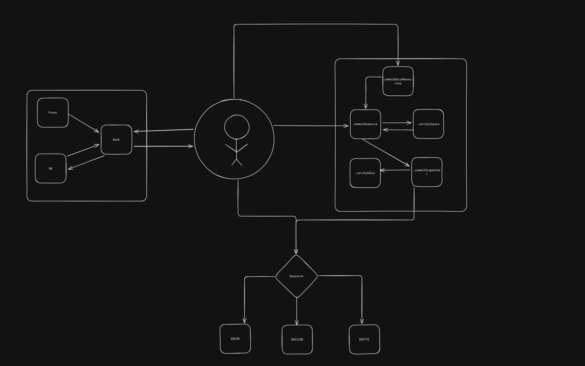

## Overview

## GameRegestry.sol

### Interactions

### External functions

- **`commitResource(bytes32 resourceHash, bytes commit, bytes signature)`**: Commit a signed game action; verifies inputs/signature, marks nonce used, dispatches the call to a target contract, and runs post-commit checks.
- **`commitBatch(uint256 nonce, bytes[] calldata commits)`**: Commit a batch of signed game actions; verifies inputs/signature, marks nonce used, dispatches the call to a target contract, and runs post-commit checks.
- **`revokeAdminRole(address account)`**: Owner-only function to revoke `DEFAULT_ADMIN_ROLE` from `account`.
- **`grantAdminRole(address account)`**: Owner-only function to grant `DEFAULT_ADMIN_ROLE` to `account`.
- **`addGameElement(GameElementType elementType, string name)`**: Adds a new game element name to the registry under a given type; restricted to `GAME_SIGNER_ROLE`.
- **`removeGameElement(GameElementType elementType, uint256 index)`**: Removes a game element name by index from a given type array; restricted to `GAME_SIGNER_ROLE`.
- **`addGameElementStruct(bytes32 nameHash, address tokenAddress, uint256 tokenId, bool requiresTokenId)`**: Registers on-chain token mapping for a resource (ERC20/721/1155, etc.) keyed by `nameHash`; restricted to `GAME_SIGNER_ROLE`.

### Public functions (overrides)

- **`renounceRole(bytes32 role, address callerConfirmation)`**: Standard AccessControl `renounceRole` with a restriction that `DEFAULT_ADMIN_ROLE` cannot be renounced.
- **`grantRole(bytes32 role, address account)`**: Standard AccessControl `grantRole` override that forbids granting `DEFAULT_ADMIN_ROLE` via this function.
- **`revokeRole(bytes32 role, address account)`**: Standard AccessControl `revokeRole` override that forbids revoking `DEFAULT_ADMIN_ROLE` via this function.

### Private functions

- **`_commitDispatcher(address target, bytes callData)`**: Low-level dispatcher that sends the commit call to `target` using `call`, reverting on failure.
- **`_verifyAfter()`**: Placeholder hook intended for protocol-level post-commit invariant checks (token supplies, etc.).
- **`_verifyInputs(bytes32 resourceHash, bytes commit, bytes signature)`**: Validates commit payload and signer, checks nonce and roles, and decodes commit into `(nonce, target, callData)`.

### Private view functions

- **`_verifySignature(address target, address account, address signer, uint256 nonce, bytes callData, bytes signature)`**: Builds a typed EIP-712 hash and verifies that the recovered signer has `GAME_SIGNER_ROLE`.
- **`_getMessageHash(address target, address account, address signer, uint256 nonce, bytes callData)`**: Constructs the EIP-712 typed data hash for a `CommitStruct` used in signature validation.

### External view functions

- **`getGameCoinsList()`**: Returns the list of registered coin names.
- **`getResourcesList()`**: Returns the list of registered resource names.
- **`getCharactersList()`**: Returns the list of registered character types.
- **`getUniqueItemsList()`**: Returns the list of registered unique item names.
- **`getGameElement(bytes32 resourceHash)`**: Returns the `GameElementStruct` describing the on-chain token mapping for a given resource hash.
