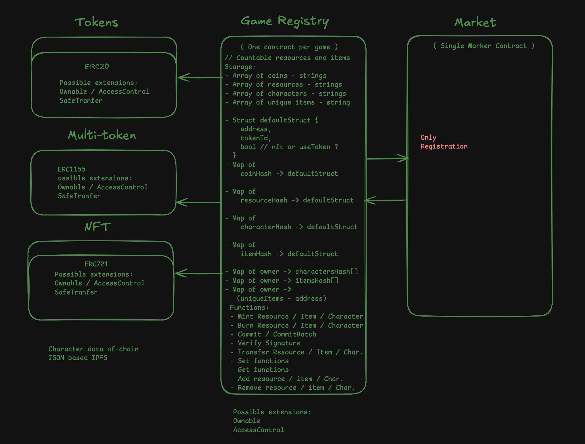

## Foundry

**Foundry is a blazing fast, portable and modular toolkit for Ethereum application development written in Rust.**

Foundry consists of:

- **Forge**: Ethereum testing framework (like Truffle, Hardhat and DappTools).
- **Cast**: Swiss army knife for interacting with EVM smart contracts, sending transactions and getting chain data.
- **Anvil**: Local Ethereum node, akin to Ganache, Hardhat Network.
- **Chisel**: Fast, utilitarian, and verbose solidity REPL.

## Documentation

https://book.getfoundry.sh/

## Overview

This package contains the smart contracts for Wizard Battle. It includes a small registry contract and a set of token contracts representing game assets and currency.

### Architecture



### Contract structure

- **GameRegestry.sol**: Central on-chain registry for core contract addresses and roles. Intended to provide a single source of truth that other contracts can reference for permissions and cross-contract lookups.
- **tokens/ ERC20 / WBCoin.sol**: Fungible in-game currency. Minting/burning is restricted to authorized game logic (e.g., game server, admin, or registry-approved operators).
- **tokens/ ERC1155 / WBResources.sol**: Multi-token resource collection (materials, consumables, etc.). Batch mint/burn and transfers for efficient gameplay operations.
- **tokens/ ERC721 / WBCharacter.sol**: Non-fungible player characters or unique items. Each token is unique and can hold metadata used by the game client.

These contracts are designed to be composed via the registry so the game backend can safely mint/burn assets and manage permissions from a single place.

## Usage

### Build

```shell
$ forge build
```

### Test

```shell
$ forge test
```

### Format

```shell
$ forge fmt
```

### Gas Snapshots

```shell
$ forge snapshot
```

### Anvil

```shell
$ anvil
```

### Deploy

```shell
$ forge script script/Counter.s.sol:CounterScript --rpc-url <your_rpc_url> --private-key <your_private_key>
```

### Cast

```shell
$ cast <subcommand>
```

### Help

```shell
$ forge --help
$ anvil --help
$ cast --help
```
